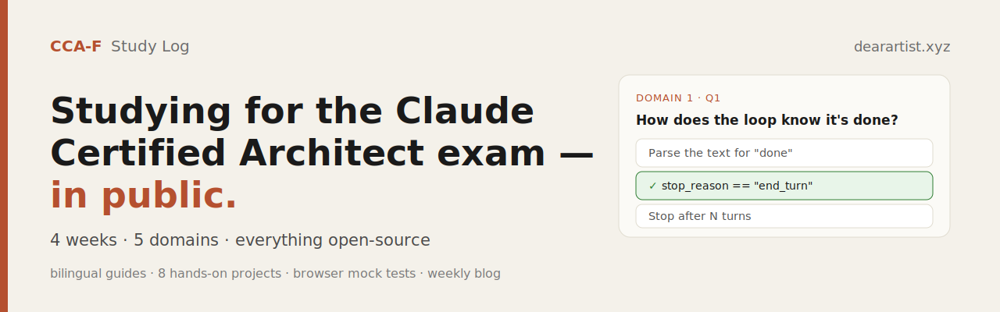

<p align="center">
  
</p>

<h1 align="center">CCA-F Study Log</h1>

<p align="center">
  Studying for Anthropic's <b>Claude Certified Architect — Foundations</b> exam, in public —<br>
  a 4-week plan, hands-on mini-projects, bilingual study guides, and mock tests you can take in your browser.
</p>

<p align="center">
  <a href="https://dearartist.xyz/blog/cca-f-week-0-the-plan"></a>
  <a href="https://yuannh.github.io/cca-f-study-log/practical_test_en.html"></a>
  
  
</p>

---

The CCA-F exam has a surprising property: **it doesn't test whether you can write code.** It tests whether you can make the right *architectural call* when an agent misbehaves in production. So this repo is built around **judgment**, not syntax — each resource leads with the *why* and the traps, not just the *what*.

> **中文读者**：这是 CCA-F 认证的公开备考资料，含 4 周计划、动手项目、双语学习指南与模拟测试。中文指南 → [`guide_zh.md`](./guide_zh.md)，中文模拟测试 → [在线试玩](https://yuannh.github.io/cca-f-study-log/practical_test_zh.html)。

## ▶ Try the mock test in your browser

No install — just click:

- 🇬🇧 **[Take the mock test (English)](https://yuannh.github.io/cca-f-study-log/practical_test_en.html)**
- 🇨🇳 **[做模拟测试（中文）](https://yuannh.github.io/cca-f-study-log/practical_test_zh.html)**

15 scenario questions across all five domains — pick your answers, grade instantly, and read the explanation for each.

## What's inside

| Resource | Description |
|---|---|
| 📘 [`guide_en.md`](./guide_en.md) / [`guide_zh.md`](./guide_zh.md) | Concept review of all five domains — EN + 中文 |
| 🧪 [`practical_test_en.html`](./practical_test_en.html) / [`practical_test_zh.html`](./practical_test_zh.html) | Interactive 15-question mock test (self-grading) |
| 🗓️ [`study-plan.md`](./study-plan.md) | The full day-by-day 4-week plan |
| ✍️ [`blog/`](./blog/) | Weekly *CCA-F Study Log* posts (also on [dearartist.xyz](https://dearartist.xyz/blog/cca-f-week-0-the-plan)) |
| 🛠️ [`hands-on/`](./hands-on/) | 8 hands-on mini-projects, incl. a runnable multi-agent demo |
| ⚙️ [`CLAUDE.md`](./CLAUDE.md) + [`.claude/`](./.claude/) | Live Claude Code config examples (a custom skill, a path-scoped rule) |

## The exam at a glance

- 60 multiple-choice questions · 120 minutes · **720/1000 to pass** · no negative marking
- Five domains: **Agentic Architecture (27%)**, Tool Design & MCP (18%), **Claude Code Config (20%)**, **Prompt Engineering (20%)**, Context & Reliability (15%)
- It rewards architectural judgment over memorized syntax.

## The 4-week plan

```
Week 1  Agentic architecture + the agent loop        (Domain 1)
Week 2  Tool design & MCP + Claude Code config        (Domains 2, 3)
Week 3  Prompt engineering + context & reliability    (Domains 4, 5)
Week 4  Full review + two mock exams
```

Full day-by-day breakdown in [`study-plan.md`](./study-plan.md).

## How to use this

1. Read the guide ([EN](./guide_en.md) / [中文](./guide_zh.md)) for concept coverage of all five domains.
2. Work the [`hands-on/`](./hands-on/) mini-projects — building the thing is what turns reading into judgment.
3. Take the mock test ([EN](https://yuannh.github.io/cca-f-study-log/practical_test_en.html) / [中文](https://yuannh.github.io/cca-f-study-log/practical_test_zh.html)).
4. Follow the weekly [blog](https://dearartist.xyz/blog/cca-f-week-0-the-plan) for the narrative version.

## Official resources

- [Anthropic Academy](https://anthropic.skilljar.com/) — free courses (Claude 101, Building with the Claude API, Claude Code in Action, Introduction to MCP, MCP Advanced Topics)
- [CCA-F exam access request](https://anthropic.skilljar.com/claude-certified-architect-foundations-access-request)
- [CertSafari — free practice bank](https://www.certsafari.com/anthropic/claude-certified-architect)

> The official **Exam Guide PDF** is the source of truth for domain weights and scenarios. It is Anthropic's copyrighted material and is intentionally **not** redistributed here — get it from the official portal.

## A note on integrity

Skip paid "dump" / "braindump" sites — the content is unverifiable, often stale, and using it can violate Anthropic's exam-integrity terms. The free official courses + CertSafari + the Exam Guide cover the material completely.

---

<p align="center"><sub>An independent study project by <a href="https://dearartist.xyz">Haixiang Yuan</a>. Not affiliated with or endorsed by Anthropic.</sub></p>
